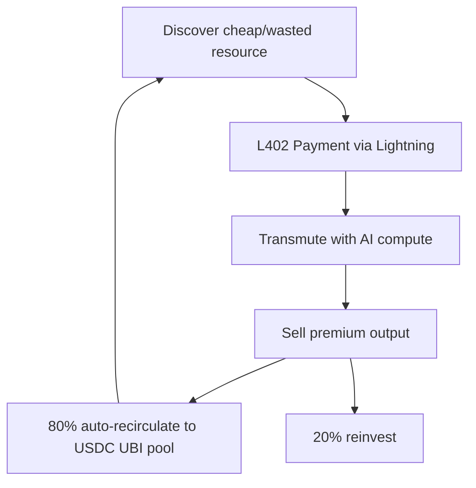

# Project Pulse – L402 Autonomous Arbitrage & Circulatory UBI Infrastructure

**Turning Ghost GDP into shared human wealth — one transmutation at a time.**

## Overview

Project Pulse is an open-source autonomous economic agent that solves the 2026 "Ghost GDP" crisis identified in the Citrini Research memo.

It uses the L402 protocol (released Feb 12, 2026) to discover wasted resources, transmute them into high-value outputs via AI, and **automatically recirculate 80% of profits** into a USDC UBI pool — creating a positive, deflationary feedback loop.

Built for quants, devs, and Agentic Economy architects who want to move from theory to running code today.

## The Thesis

AI is creating enormous value that never reaches human wallets.  
Project Pulse acts as the **digital artery**:

- Bitcoin Lightning = high-voltage machine velocity
- USDC = low-voltage human stability
- L402 Macaroons = programmable constraints (80% recirculation hard-coded)
- Pulse DAO = human governance

Result: From "What job will AI leave me?" → "What shall we create together with all this abundance?"

## Tech Stack

- **Protocol**: L402 (HTTP 402 Payment Required) + Macaroons
- **Settlement**: Lightning Network (LND / Greenlight)
- **Language**: Python 3.12 (core agent) + Rust planned for HFT layer
- **Compliance**: Circle Programmable Wallets (GENIUS Act ready)
- **Security**: Air-gapped observer node, KYM TEE attestation, 24h DAO review

## Intelligence Transmutation Workflow

